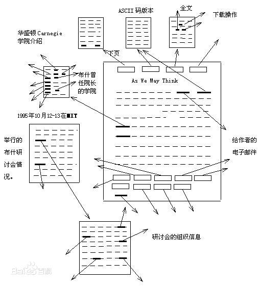

## 基础概念
#### 文本和超文本
1. 文本，是指书面语言的表现形式，后缀doc，txt等都可以理解为文本的载体。
2. 超文本是用超链接的方法，将各种不同空间的文字信息组织在一起的网状文本。超文本更是一种用户界面范式，用以显示文本及与文本之间相关的内容。
    

## HTTP基础相关概念
##### HTTP历史 
1. HTTP 协议始于三十年前蒂姆·伯纳斯 - 李的一篇论文；
2. HTTP/0.9 是个简单的文本协议，只能获取文本资源；
3. HTTP/1.0 确立了大部分现在使用的技术，但它不是正式标准；
4. HTTP/1.1 是目前互联网上使用最广泛的协议，功能也非常完善；
5. HTTP/2 基于 Google 的 SPDY 协议，注重性能改善，但还未普及；
6. HTTP/3 基于 Google 的 QUIC 协议，是将来的发展方向。
#### HTTP是什么?
1. 状态码

    ```json
    200 成功
    204 没有请求体
    206 范围请求，断点续传
    
    301 永久重定向
    302 临时重定向
    304 服务器设置缓存
    307 不改变请求的方法
    
    404 not found
    401 没有登录
    403 登录无法访问
    
    500 
    502
    ```

    

## HTTP发展FQA
#### 推动 HTTP 发展的原动力是什么？
1. 从历史的进程来看，就是互联网的用户推动协议的发展的。刚刚开始只有文本，都只是文字；后来有了超文本，不仅仅是文字；后来嫌弃速度慢，有了持久连接，缓存机制；后来为了安全，有了加密通信。一切都是以用户的需求为导向的，用户的需要越来越高，协议就越来越高级，越来越完善。
2. 本质上是有了uri可以统一标示一个资源，然后html可以让所有的资源组织成网，再然后集成多种资源，例如文本，图片，音频，视频等。这样就能让各种资源互联，并且用户可以很容易的访问他们。因为简单，带动用户增长，用户增长反过来带动技术。这部分是直接需求，所以从直接需求来说，http协议，并不是重点，也可以设计成其他形式，能很好的适应uri和www就行了。不过http协议的设计遵循的是简单，清晰，不过度设计，刚刚好的原则，或者说是kiss原则。当事情发展到一定程度，kiss不够用的时候，再改改。不够安全就加一个tls层，短连接性能不好就改成长的，tcp性能不好，就改成udp。
3. KISS 原则是用户体验的高层境界，简单地理解这句话，就是要把一个产品做得连白痴都会用，因而也被称为“懒人原则”。换句话说来，“简单就是美”。
