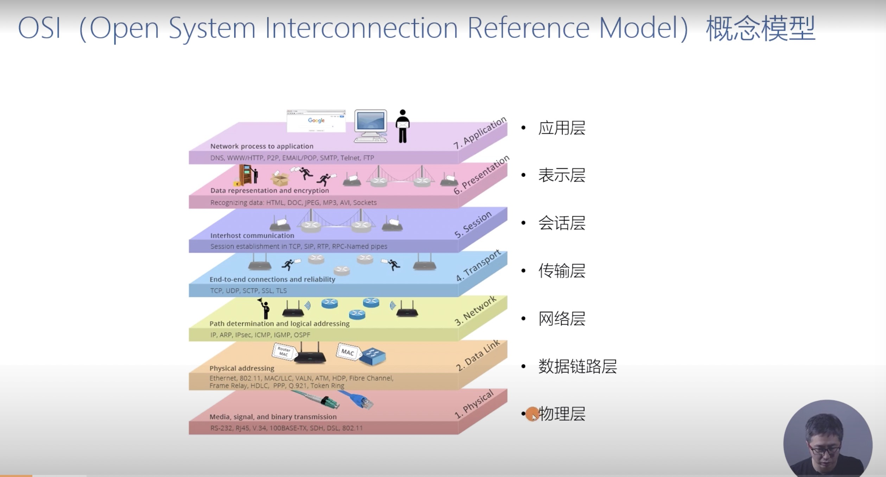
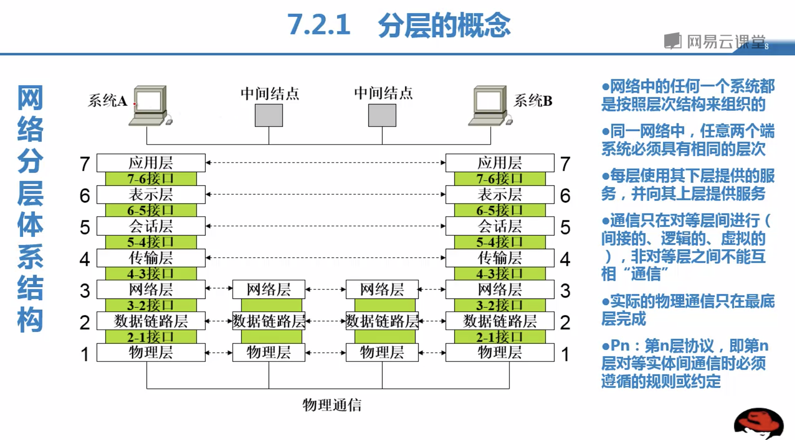
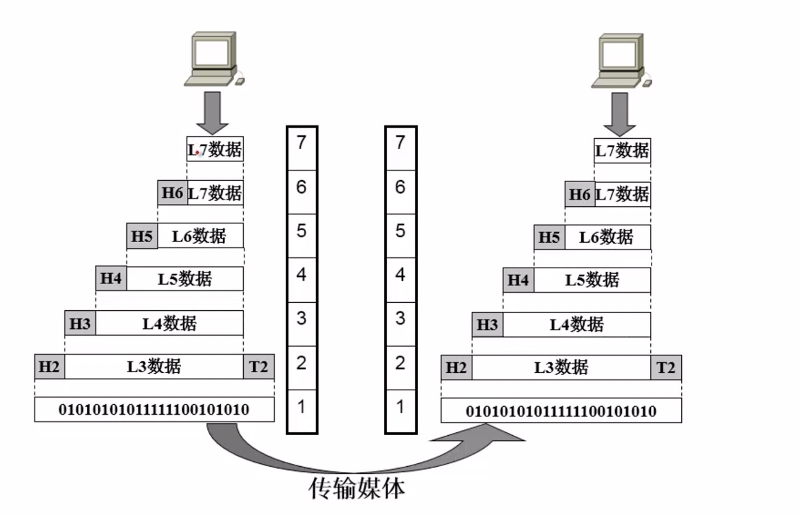

#### 开放系统互联基本参考模型OSI
1. ##### OSI七层模型
    
    |参考模型编号|名称|类型|
    |:-:|:-:|:-:|
    |7|应用层|资源子网|
    |6|表示层|资源子网|
    |5|会话层|资源子网|
    |4|传输层||
    |3|网络层|通信子网|
    |2|数据链路层|通信子网|
|1|屋里层|通信子网|
    
2. ##### OSI七层模型好处
    
    1. 各层之间是独立的
    2. 灵活性好
    3. 结构上可分隔开
    4. 易于实现和维护
5. 能促进标准化工作
    
3. ##### OSI七层模型图 
    
    
     
    
    1. 网络中的任何一个系统都是按照层次结构来组织的；
    2. 同一网络中，任意两端系统必须具有相同的层次；
    3. 每层使用其下层提供的服务，并向上层提供服务；
4. 通信只在对等层进行；
    5. 实际的物理通信只在最底层完成。
    
4. ##### 应用层作用:
    
提供应用程序运行的环境，负责管理和执行应用程序。
    
5. ##### 表示层作用:
    
为数据在传输之前，加密，解密，压缩，解压缩，终端数据格式转换提供一套规则和约定。
    
6. ##### 会话层作用:
    
对对话的双方进行资格审查和验证的规则，同时规定发送时双工模式。
    
7. ##### 传输层作用:
    
两个主要目的: a. 传输层可以提供在不同系统之间的进程间数据交互的可靠服务，在网络内两个实体之间建立端到端的通行通道，用来传输信息或报文分组，本层提供两端点可靠、透明的数据传输； b. 可以为会话层提供与网络类型无关的可靠信息传输机制，对会话层遮蔽了下层网络操作细节。
    
8. ##### 网络层作用:
    
代表：交换机，路由器，负责建立，保持，终止通过中间设备的连接，同时负责通信子网内路径选择和拥挤控制。
    
9. ##### 数据链路层作用:
    
网卡里面的MAC地址, 主要功能a. 如何将数据组装成帧，帧是本层传输单位，b. 如何处理数据在传输过程中出现差错， c. 如何调节发送速率使之与接收方向匹配，在两个网络实体之间提供数据链路的简历、维持和释放功能。
    
10. ##### 物理层作用:
    
包括设备之间物理连接的接口与网络终端设备之间的传输规则。
    
11. ##### OSI七层模型使用方式
    
   1. 图文说明
       
   2. 视频说明
      视频说明使用方式在 videos 文件下 OSI_USE.mov 中