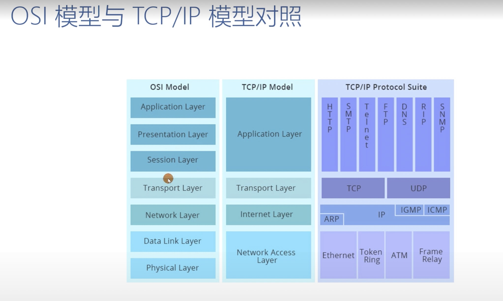
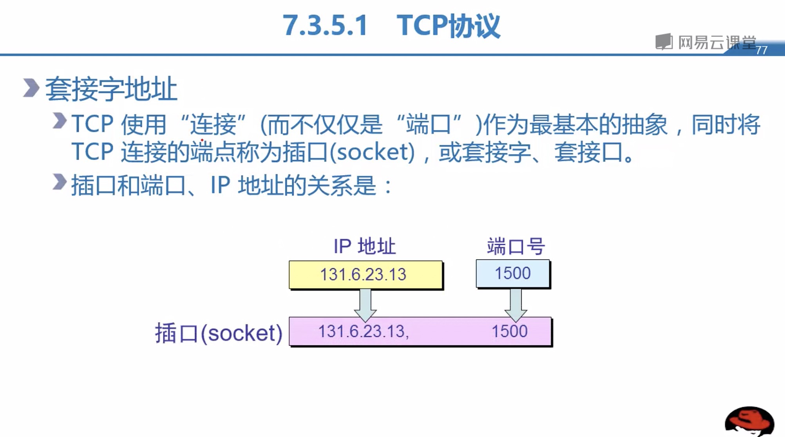
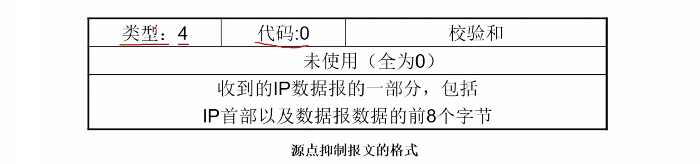
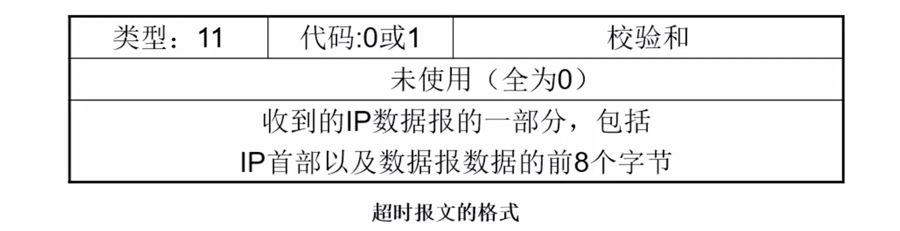

### TCP/IP 协议基本简介 
1. #### OSI 对应 TCP/IP 模型
   


    
2. #### TCP/IP 体系结构分为四个层次
   
    1. ##### 应用层
       
        服务于Telnet、Ftp、Smtp等，负责处理特定的查询细节。
        
    2. ##### 传输层
    
        包括TCP和UDP，TCP是一个简单可靠的面向连接传输协议，保障某一主机的字节流准确无误地投送到互联网上另一台主机；UDP是无连接的服务，无重发和纠错功能，不保证数据的可靠传输。
    
    3. ##### 网络层

        包括IP、ICMP、IGMP，也称互联层，其主要任务是路径选择，让每个分组独立地到达目的地，在接收端由高层协议重排。因IP层提供数据服务，常常将报文分组称为IP数据报。
    
    4. ##### 网络接口层
    
        也称数据链路层或链路层，通常包括网络接口卡或设备驱动，之所以没有定义数据链路层，是因为TCP/IP最初的设计中已经考虑到多种数据链路协议。
    
    5. ##### 四层各个协议总体传输示意图简图
    
      
    
3. #### TCP/IP协议集的主要协议图解
   
    
    
    ##### FTP 协议示例
    
    


#### TCP/IP 协议四层

1. ##### 应用层
   
    单独做分析
    
2. ##### 传输层

    1. ###### 通信TCP/IP简图 

      

    2. ###### 端口范围:
       
       
        a. 熟知端口(著名端口)， 0-1023，由ICANN指派和控制<br> 
        b. 注册端口，1024-49151，IANA即不指派和不控制，但需注册<br> 
        c. 动态端口(短暂端口)，49152-65535，IANA即不指派和不控制，无需注册<br> 
        备注: <font color=red>由应用程序产生应用进程，由应用进程产生进程端口号，由端口号提供相应的服务。</font><br> 
        
    3. ##### TCP 各个图谱简介

        1. ###### TCP,UDP 发送方复用，接收方分用 

          

        2. ###### 网络层和传输层的主要区别简图 

          

        3. ###### <font color=red>TCP套接字</font>

          

        4. ###### TCP发送-接收流程图

          

        5. ###### 总结: 
           
            a. TCP发送进程以字节流的形式传递数据，而接收方也把数据作为字节流来接收，类似于假想的管道
            
            b. UDP发送进程发送的数据报文都是独立的，因此UDP不是面向流的协议 
            c. 缓存，数据流向的每一个方向上都有两种缓存，发送缓存和接收缓存 
            d. 在传输层IP层发送的数据时要以分组为单位，而不是字节流来发送，TCP协议把若干个字节构成一个分组，我们可以把这样的分组称为“报文段(segment)”，这种报文段并不一定都一样长，可以几个字节，也可以是几千个字节。 
            
        6. ###### 字节号和序列号

            1. ###### 字节号

              以字节为单位，字节号的定义范围(0~2^32-1)，编号机制随机。 
              举例: 假如随机号正是1057，而要发送6000个字节，那么字节编号范围是: 1057~7056。 

            2. ###### 序列号 

              以字节为基础，TCP给每一个报文指派一个序列号，每个报文段的序列号就是在这个报文段中的第一个字节数据的序列号。
              举例: 

              比如TCP要传输6000个字节的文件，第一个字节编号是10001。如果数据用5个报文段来发送，前4个报文段各携带1000个字节，最后一个报文段携带2000个字节的数据:

              ​	报文段1 --> 序列号10001(字节号范围:10001~11000);

              ​    报文段2 --> 序列号11001(字节号范围:11001~12000);

              ​    报文段3 --> 序列号12001(字节号范围:12001~13000);

              ​    报文段4 --> 序列号13001(字节号范围:13001~14000);

              ​    报文段5 --> 序列号14001(字节号范围:14001~16000).

    4. ##### <font color=red>TCP报文段详解</font>

        

        1. 源端口和目的端口字段，各占2个字节。端口号是运输层与应用层的服务接口，运输层的复用和分用功能都要通过端口才能实现。
        2. <font color=red>序列号</font>字段占4个字节。TCP连接中传送的数据流中的每一个字节都编上序列号，序列号字段的值则指的是所发送的数据的第一个字节的序列号。
        3. <font color=red>确认号</font>字段占4个字节，是期望收到对方的下一个报文段的数据的第一个字节的序列号。
        4. <font color=red>URG、ACK、PSH、RST、SYN、FIN</font>
            1. 紧急比特URG，当URG=1时，表明紧急指针字段有效，它告诉系统此报文段中有紧急数据，应尽快传送(相当于高优先级数据)；
            2. 确认比特ACK，只有当ACK=1时<font color=red>确认号</font>字段才有效。当ACK=0时，确认号是无效的。
            3. 推送比特PSH，接受TCP收到推送比特置1的报文段，就尽快的交付给接受应用进程，而不再等到整个缓存都填满了后再向上交付。
            4. 复位比特RST，当RST=1时，表明TCP连接中出现严重出错(如由于主机崩溃、拒绝连接、异常连接、其他原因)，必须释放连接，然后再重新建立运输连接。
            5. 同步比特SYN置为1，就表示这是一个连接请求或连接接受报文
            6. 终止比特FIN，用来释放一个连接。当FIN=1时，表明此报文段的发送端的数据已发送完毕，并要求 释放运输连接。
        5. 窗口字段，占2个字节。窗口字段用来控制对方发送的数据量，单位为字节。TCP连接的一端根据设置的缓存空间大小确定自己的接收窗口大小，然后通知对方以确定对方的发送窗口的上限。
        6. 抓包分析
        ```c
        Transmission Control Protocol, Src Port: 49390, Dst Port: 443, Seq: 423, Ack: 169, Len: 0
            Source Port: 49390 // 源端口
            Destination Port: 443 // 目的地端口
            [Stream index: 0]
            [TCP Segment Len: 0]  
            Sequence number: 423    (relative sequence number) // 序列号 相对序列号
            [Next sequence number: 423    (relative sequence number)] // 确认号
            Acknowledgment number: 169    (relative ack number)
            0101 .... = Header Length: 20 bytes (5) // 20个字节，无选项字段
            Flags: 0x010 (ACK)  // 标志位
            Window size value: 237 // 告诉服务器缓存大小字节数
            [Calculated window size: 30336]
            [Window size scaling factor: 128] // 接收的伸缩系数  237*128=30336
            Checksum: 0xfc06 128    
            [Checksum Status: Unverified]
            Urgent pointer: 0
            [SEQ/ACK analysis]
            [Timestamps]
        ```
    5. ##### <font color=red>TCP三次握手</font>

        TCP是面向连接的，无论哪一方向另一方发送数据之前，都必须先在双方之间建立一条连接。在TCP/IP协议中，TCP协议提供可靠的连接服务，连接是通过三次握手进行初始化的。三次握手的目的是<font color=red>同步连接双方的序列号和确认号并交换 TCP窗口大小信息</font>。 
        

        1. ###### 第一次握手： 

           建立连接。客户端发送连接请求报文段，将SYN位置为1，Sequence Number为x；然后，客户端进入SYN_SEND状态，等待服务器的确认；
        ```c
        Sequence number: 4199514482     // 随机产生的序列号
        Flags: 0x002 (SYN)
            000. .... .... = Reserved: Not set
            ...0 .... .... = Nonce: Not set
            .... 0... .... = Congestion Window Reduced (CWR): Not set
            .... .0.. .... = ECN-Echo: Not set
            .... ..0. .... = Urgent: Not set
            .... ...0 .... = Acknowledgment: Not set
            .... .... 0... = Push: Not set
            .... .... .0.. = Reset: Not set
            .... .... ..1. = Syn: Set   // SYN标志置为1，表示请求
            .... .... ...0 = Fin: Not set
            [TCP Flags: ··········S·]
        
        ```
        2. ###### 第二次握手：

           服务器收到SYN报文段。服务器收到客户端的SYN报文段，需要对这个SYN报文段进行确认，设置Acknowledgment Number为x+1(Sequence Number+1)；同时，自己自己还要发送SYN请求信息，将SYN位置为1，Sequence Number为y；服务器端将上述所有信息放到一个报文段（即SYN+ACK报文段）中，一并发送给客户端，此时服务器进入SYN_RECV状态；
        ```c
        Sequence number: 38843401
        Acknowledgment number: 4199514483   //  第一次握手的序列号+1
        Flags: 0x012 (SYN, ACK)
            000. .... .... = Reserved: Not set
            ...0 .... .... = Nonce: Not set
            .... 0... .... = Congestion Window Reduced (CWR): Not set
            .... .0.. .... = ECN-Echo: Not set
            .... ..0. .... = Urgent: Not set
            .... ...1 .... = Acknowledgment: Set    // ACK标志置为1，表示请求
            .... .... 0... = Push: Not set
            .... .... .0.. = Reset: Not set
            .... .... ..1. = Syn: Set       // SYN标志置为1，表示请求
            .... .... ...0 = Fin: Not set
            [TCP Flags: ·······A··S·]
        ```
        3. ###### 第三次握手： 

           客户端收到服务器的SYN+ACK报文段。然后将Acknowledgment Number设置为y+1，向服务器发送ACK报文段，这个报文段发送完毕以后，客户端和服务器端都进入ESTABLISHED状态，完成TCP三次握手。
        ```c
        Sequence number: 4199514483
        Acknowledgment number: 38843402
        Flags: 0x010 (ACK)
            000. .... .... = Reserved: Not set
            ...0 .... .... = Nonce: Not set
            .... 0... .... = Congestion Window Reduced (CWR): Not set
            .... .0.. .... = ECN-Echo: Not set
            .... ..0. .... = Urgent: Not set
            .... ...1 .... = Acknowledgment: Set        // ACK标志置为1
            .... .... 0... = Push: Not set
            .... .... .0.. = Reset: Not set
            .... .... ..0. = Syn: Not set
            .... .... ...0 = Fin: Not set
            [TCP Flags: ·······A····]
        ```
        4. ###### <font color=red>为什么需要三次握手?</font> 

          为了防止已失效的连接请求报文段突然又传送到了服务端，因而产生错误。具体例子：“已失效的连接请求报文段”的产生在这样一种情况下：client发出的第一个连接请求报文段并没有丢失，而是在某个网络结点长时间的滞留了，以致延误到连接释放以后的某个时间才到达server。本来这是一个早已失效的报文段。但server收到此失效的连接请求报文段后，就误认为是client再次发出的一个新的连接请求。于是就向client发出确认报文段，同意建立连接。假设不采用“三次握手”，那么只要server发出确认，新的连接就建立了。由于现在client并没有发出建立连接的请求，因此不会理睬server的确认，也不会向server发送数据。但server却以为新的运输连接已经建立，并一直等待client发来数据。这样，server的很多资源就白白浪费掉了。采用“三次握手”的办法可以防止上述现象发生。例如刚才那种情况，client不会向server的确认发出确认。server由于收不到确认，就知道client并没有要求建立连接。”

    6. ##### <font color=red>四次挥手</font>

        
        
        备注: 当客户端和服务器通过三次握手建立了TCP连接以后，当数据传送完毕，肯定是要断开TCP连接的啊。那对于TCP的断开连接，这里就有了神秘的“四次分手”。

        1. ###### 第一次分手： 

           主机A（可以使客户端，也可以是服务器端），设置Sequence Number，向主机B发送一个FIN报文段；此时，主机A进入FIN_WAIT_1状态；这表示主机A没有数据要发送给主机B了；

        2. ###### 第二次分手： 

           主机B收到了主机A发送的FIN报文段，向主机A回一个ACK报文段，Acknowledgment Number为Sequence Number加1；主机A进入FIN_WAIT_2状态；主机B告诉主机A，我“同意”你的关闭请求；

        3. ###### 第三次分手： 

           主机B向主机A发送FIN报文段，请求关闭连接，同时主机B进入LAST_ACK状态；

        4. ###### 第四次分手： 

           主机A收到主机B发送的FIN报文段，向主机B发送ACK报文段，然后主机A进入TIME_WAIT状态；主机B收到主机A的ACK报文段以后，就关闭连接；此时，主机A等待2MSL后依然没有收到回复，则证明Server端已正常关闭，那好，主机A也可以关闭连接了。

        5. ###### <font color=red>为什么要四次分手？</font>

          TCP协议是一种面向连接的、可靠的、基于字节流的运输层通信协议。TCP是全双工模式，这就意味着，当主机A发出FIN报文段时，只是表示主机A已经没有数据要发送了，主机A告诉主机B，它的数据已经全部发送完毕了；但是，这个时候主机A还是可以接受来自主机B的数据；当主机B返回ACK报文段时，表示它已经知道主机A没有数据发送了，但是主机B还是可以发送数据到主机A的；当主机B也发送了FIN报文段时，这个时候就表示主机B也没有数据要发送了，就会告诉主机A，我也没有数据要发送了，之后彼此就会愉快的中断这次TCP连接。

    7. ##### TCP确认机制 (重传机制)

        
        在发送2145时出错了，这时服务器没有收到2145报文，服务器发送一个请求，希望客户端重新传送一下，这时客户端重新在传送。

        1. TCP窗口机制
            

3. 网络层
    1. 包含IP协议，ARP地址解析协议，RARP地址反向解析协议，ICMP互联网控制协议

    2. IP协议功能
       
        1. 寻址和路由  
        2. 传递服务（不可靠，可靠(可靠比如HTTP协议)由上层协议控制；无连接 
        3. 数据报分段和重组  
        
        ```c
        Internet Protocol Version 4, Src: 111.48.171.87, Dst: 192.168.1.7
            0100 .... = Version: 4   // 0100 = 4
            .... 0101 = Header Length: 20 bytes (5)
            Differentiated Services Field: 0x04 (DSCP: Unknown, ECN: Not-ECT) // 服务类型
                0000 01.. = Differentiated Services Codepoint: Unknown (1) // 后两位 01 临时实验报； 00 是因特网数据报
                .... ..00 = Explicit Congestion Notification: Not ECN-Capable Transport (0)
            Total Length: 77
            Identification: 0x6ad7 (27351) // 文件夹videos/IP_标识_标志_片偏移.mov中详细说明
            Flags: 0x4000, Don't fragment
            Time to live: 57 // 生存时间(8bit)记为TTL，这是为了限制数据报在网络中的生存时间，其最初单位为秒，但为了方便，现在都用“跳数”作为TTL的单位，数据报每经过一个路由器，其TTL都减1.
            Protocol: TCP (6) // 上层协议
            Header checksum: 0xfa98 [validation disabled]
            [Header checksum status: Unverified]
            Source: 111.48.171.87
            Destination: 192.168.1.7
        ```
        4. IP协议缺点
            1. 无差错报告和差错纠正报告
            2. 缺少一种为主机和管理查询的机制
        
    3. ##### ARP协议

        1. ###### 主要功能:
            
            1. 逻辑地址，三个特点， 全球唯一，软件实现，日常以十进制方式表示，二进制位32位, 工作在网络层。
            
            2. 物理地址，即MAC个地址，三个特点，本地范围唯一，用硬件实现，日常以十六进制方式表示，二进制位48位, 工作在网络接口层。
            
            3. 不管网络层使用什么协议，在实际网络的链路上传送数据帧时，最终还是必须使用硬件地址。
            
            4. 在每一个主机都设有ARP高速缓存(ARP Cache)，里面有所有在局域网上的各个主机和路由器的IP地址到硬件地址的映射表。
            
            5. 当主机A欲向本局域网的某个主机B发送IP数据报时，就先在ARP高速缓存表中查看有无主机B的IP的地址。如果有，就可查出其对应的硬件地址，再将此硬件地址写入MAC帧中，然后通过局域网将MAC地址发此硬件地址。
                MAC地址示例(8421)
            
              74-E5-35-60--16 <==> 0111 0100-1110 0101-0011 01010-0110 0000-0001 0110
              
            
        2. ##### 局域网内ARP通信工作原理 
           
            局域网抓包分析图
            
            请求发送方抓包 和 应答抓包
        ```c
        Ethernet II, Src: Apple_1c:3e:d4 (8c:85:90:1c:3e:d4), Dst: Broadcast (ff:ff:ff:ff:ff:ff)
            Destination: Broadcast (ff:ff:ff:ff:ff:ff)
                Address: Broadcast (ff:ff:ff:ff:ff:ff)  // 广播形式传播
                .... ..1. .... .... .... .... = LG bit: Locally administered address (this is NOT the factory default)
                .... ...1 .... .... .... .... = IG bit: Group address (multicast/broadcast)
            Source: Apple_1c:3e:d4 (8c:85:90:1c:3e:d4)
            Type: ARP (0x0806)  // ARP 标识
        
            Address Resolution Protocol (request) // 请求
            Hardware type: Ethernet (1)
            Protocol type: IPv4 (0x0800)
            Hardware size: 6 // 硬件大小
            Protocol size: 4
            Opcode: request (1) // 请求信息是1
            Sender MAC address: Apple_1c:3e:d4 (8c:85:90:1c:3e:d4) // 发送方MAC地址
            Sender IP address: 192.168.1.7 // 发送方IP
            Target MAC address: 00:00:00_00:00:00 (00:00:00:00:00:00) // 暂时用0填充
            Target IP address: 192.168.1.1
        ```
        ```c
        Address Resolution Protocol (reply) // 单播形式回复
        Hardware type: Ethernet (1)
        Protocol type: IPv4 (0x0800)
        Hardware size: 6
        Protocol size: 4
        Opcode: reply (2) // 回复信息是2
        Sender MAC address: b4:d0:a9:48:d7:70 (b4:d0:a9:48:d7:70) // 发送方MAC地址
        Sender IP address: 192.168.1.1 // 发送方IP
        Target MAC address: Apple_1c:3e:d4 (8c:85:90:1c:3e:d4) // 应答方MAC地址
        Target IP address: 192.168.1.7 // 应答方IP
        ```
        3. ###### 广域网ARP通信  
            
            视频详解在 videos/广域网ARP.mov
        4. ###### 本机电脑上arp映射表
        ```c
            arp -a // 查看
            arp -d // 清除
        ```
        5. ###### 有了IP地址为什么要用MAC地址解答? 
            
            1. IP地址一般情况下容易修改和改动，具有随意性，不能在网络上固定标识一台设备；
            2. MAC地址一般情况出厂时由厂家烧录到硬件中，不容易修改，在局域范围内容易定位唯一一台设备；
            3. 从拓扑结构和分层上分析，IP地址属于网络层协议，主要功能是在广域网范围内路由寻址，选择最佳路由，而MAC地址在网络接口层要形成合适于在网络媒体上传输的数据帧。查看文档 [链接](https://blog.csdn.net/hjding/article/details/80301389)
        [知乎链接](https://www.zhihu.com/question/21546408)
        6. ###### ARP分组格式 
            
        
    
    4. ##### RARP 反向地址解析协议
        
    MAC地址 ==> IP地址
        
    5. ##### ICMP 互联网控制消息协议 (弥补IP协议缺点)
        
        1. ###### ICMP 协议是封装在IP协议里面
        
          
        2. ###### 抓包分析 总体总包(从下往上) ICMP-request详细包结构 ICMP-reply详细包结构
        ```c
        Frame 10: 98 bytes on wire (784 bits), 98 bytes captured (784 bits) on interface 0 // 网络接口层
            Ethernet II, Src: Apple_1c:3e:d4 (8c:85:90:1c:3e:d4), Dst: b4:d0:a9:48:d7:70 (b4:d0:a9:48:d7:70) // 以太网
            Internet Protocol Version 4, Src: 192.168.1.7, Dst: 112.34.111.167
                ...
                Protocol: ICMP (1) // IP协议里面包含了ICMP协议
                ...
            Internet Control Message Protocol // ICMP协议
        ```
        ```c
        Internet Control Message Protocol
            Type: 8 (Echo (ping) request) // 请求报文 8位
            Code: 0 // 8位
            Checksum: 0x2af2 [correct]  // 校验和 16位
            [Checksum Status: Good]
            Identifier (BE): 18470 (0x4826) // linux
            Identifier (LE): 9800 (0x2648) // window 标识符 16位
            Sequence number (BE): 0 (0x0000) // linux
            Sequence number (LE): 0 (0x0000) // window 序列号 16位
            [Response frame: 11]
            Timestamp from icmp data: Feb 11, 2020 13:55:02.195049000 CST
            [Timestamp from icmp data (relative): 0.000052000 seconds]
            Data (48 bytes)
        ```
        ```c
        Internet Control Message Protocol
            Type: 0 (Echo (ping) reply)
            Code: 0
            Checksum: 0x7cd7 [correct]
            [Checksum Status: Good]
            Identifier (BE): 53603 (0xd163)
            Identifier (LE): 25553 (0x63d1)
            Sequence number (BE): 0 (0x0000)
            Sequence number (LE): 0 (0x0000)
            [Request frame: 239276]
            [Response time: 52.630 ms]
            Timestamp from icmp data: Feb 11, 2020 17:21:15.128626000 CST
            [Timestamp from icmp data (relative): 0.052669000 seconds]
            Data (48 bytes)
            Data: 08090a0b0c0d0e0f101112131415161718191a1b1c1d1e1f...
            [Length: 48]
        ```
        3. ###### ICMP报文种类
            
            1. ###### ICMP报文种类图谱 
                
            
                
            2. ###### 差错报文有以下要点
               
                a. 对于携带ICMP差错报文的数据报，不再产生ICMP差错报文
                
                b. 对于分片的数据报，如果不是第一个分片，则不产生ICMP差错报文
                
                c. 对于具有多播地址的数据报，不产生ICMP差错报文
                
                d. 对于具有特殊地址(如127.0.0.0 或者 0.0.0.0)的数据报，不产生ICMP差错报文
                
            3. ###### 终点不可达 
            
                当路由器不能够给数据报找到路由或主机，不能够交付数据报时，就丢弃这个数据报，然后这个路由器或主机就向发出这个数据报的源主机发出<font color=red>终点不可达报文</font> 
                
                
            
            4. ###### 源点抑制
                
            1. IP协议是无连接协议，没有流量控制，容易产生<font color=red>拥塞</font> 
                
                2. ICMP源点抑制报文就是给IP增加一个流量控制而设计的，这个报文有两个目的:
                   
                    a. 它通知源点，数据报因拥塞已经被丢弃
                    
                    b. 它警告源点，在路径中的某处出现了拥塞，因而源点放慢(抑制)发送过程 
                
                
            5. ###### 超时
                
                1. 当路由器收到生成时间字段值为零时的数据报时，就丢弃这个数据报，并向源点发送超时报文。
                2. 当最后的终点在规定的时间内没有收到所有分片时，它就丢弃已经收到的分片，并向源点发送超时报文。
                3. 在超时报文中，代码0只给路由器使用，表示生成时间字段值为0； 代码1只有目的主机使用，它表示在规定的时限内，不是所有分片都到达了。
            
                
            6. ###### 回送请求和回送应答 
                
            
            
            7. ###### 时间戳请求和应答
                
                1. 发送时间 = 接受时间戳的值 - 原始时间戳的值 
                2. 接受时间 = 分组返回的时间 - 发送时间戳的值
            3. 往返时间 = 发送时间 + 接受时间 
            
                
            8. ###### 跟踪路由命令
            ```c
                traceroute www.baidu.com    // mac
                tracerr www.baidu.com    // window
            ```
        
    6. ##### ICMP应用实例<font color=red>ping</font>、<font color=red>traceroute</font>(ICMP范畴，属于ICMP查询，回送请求和回送应答) [链接](https://juejin.im/post/5c7cedaaf265da2da15ddbad)
        
        1. ###### ping  
            
            1. Type(8)是请求回显报文(Echo)；Type(0)是回显应答报文(Echo Reply),
            请求回显或回显应答报文属于查询报文。<font color=red>ping</font>Ping就是用这种报文进行查询和回应。
            2. Ping的完整工作流程: Ping本质上是ICMP数据包，所以其工作流程就是ICMP数据包的发送与解析流程。大致流程如下：构造ICMP数据包-->构造IP数据包-->构造以太网数据帧---->物理传输到目标主机---->获取以太网数据帧-->解析出IP数据包-->解析出ICMP数据包-->发送回送应答报文。
            3. 本地主机处理流程: 
                a. 在本地，ping命令会构建一个ICMP数据包（构造回送请求报文） 
                b. 将该ICMP数据包和目标IP地址给IP协议，IP协议将本地地址作为源地址，与目的地址等构造IP数据包 
                c. 根据本地ARP缓存查找目的地址IP对应的MAC地址，如果缓存中没有则通过ARP协议找到对应IP的MAC地址。将MAC地址交给数据链路层以构造数据帧 
            d. 经物理层发送给目的主机
            4. 目的主机处理流程: 
                a. 目的主机接收到数据包 
                b. 物理层接收到二进制数据流经数据链路层，按照以太网协议解析出数据帧，如果数据帧中的目标MAC地址与本机MAC地址相同，则接收该数据包，否则丢弃该数据包。 
                c. 收到该数据包之后，经网络层解析出IP数据包，通过IP包头中的协议字段判断出是ICMP数据包。之后解析出ICMP数据包，发现是回送请求报文（ping request）后马上构建一个ICMP回送应答报文（ping reply） 
                d. 将封装好的ICMP数据包经网络层、数据链路层、物理层发送回源主机 
            结论:<font color=red>Ping的本质其实就是ICMP回送请求报文和回送应答报文</font>
        2. ###### traceroute
            
            1. 基于UDP实现traceroute工作原理: 在基于UDP的实现中，客户端发送的数据包是通过UDP协议来传输的，使用了一个大于30000的端口号，服务器在收到这个数据包的时候会返回一个端口不可达的ICMP错误信息，客户端通过判断收到的错误信息是TTL超时还是端口不可达来判断数据包是否到达目标主机。流程如下: 
                a. 源主机向目的主机发送一连串的 IP 数据报（UDP报文）。第一个数据报 P1 的生存时间 TTL 设置为 1，当 P1 到达路径上的第一个路由器 R1 时，R1 收下它并把 TTL 减 1，此时 TTL 等于 0，R1 就把 P1 丢弃，并向源主机发送一个 ICMP 时间超过差错报告报文； 
                b. 源主机接着发送第二个数据报 P2，并把 TTL 设置为 2。P2 先到达 R1，R1 收下后把 TTL 减 1 再转发给 R2，R2 收下后也把 TTL 减 1，由于此时 TTL 等于 0，R2 就丢弃 P2，并向源主机发送一个 ICMP 时间超过差错报文。 
                c. 不断执行这样的步骤，直到最后一个数据报刚刚到达目的主机，主机不转发数据报，也不把 TTL 值减 1。但是因为数据报封装的是无法交付的 UDP，因此目的主机要向源主机发送 ICMP 终点不可达差错报告报文。 
                d. 之后源主机知道了到达目的主机所经过的路由器 IP 地址以及到达每个路由器的往返时间。
            2. 基于ICMP实现的tracert工作原理:  
            在这一种实现中我们不使用UDP协议，而是直接发送一个ICMP回显请求（echo request）数据包，服务器在收到回显请求的时候会向客户端发送一个ICMP回显应答（echo reply）数据包。流程与上面相似，只是最后判断结束上为目标主机（而不是中间经过的主机或路由器）返回一个ICMP回显应答，则结束。
    
4. ##### 网络接口层 (包含广域网和局域网) 

    1. ###### 网络接口层对应OSI模型中的物理层和数据链路层

       链路层协议执行的主要任务: 
       
        a. 管理对所使用的任何联网介质访问，被称为介质访问控制(MAC), 与传输媒体有关。
       
        b. 创建一对MAC层地址之间点到点的临时连接以传输数据，称为逻辑链路控制(LLC)。
       
    2. ###### 将局域网的数据链路层拆分为两个子层: 

        a. MAC子层的主要功能：帧的封装和拆封，物理介质传输差错的检测，寻址，实现介质访问控制协议。

        b. LLC子层的主要功能：连接管理(建立和释放连接)，与高层的接口(网络层), 帧的可靠，按序传输和流量控制。

#### 学习参考
1. [链接](https://juejin.im/post/598ba1d06fb9a03c4d6464ab#heading-8)