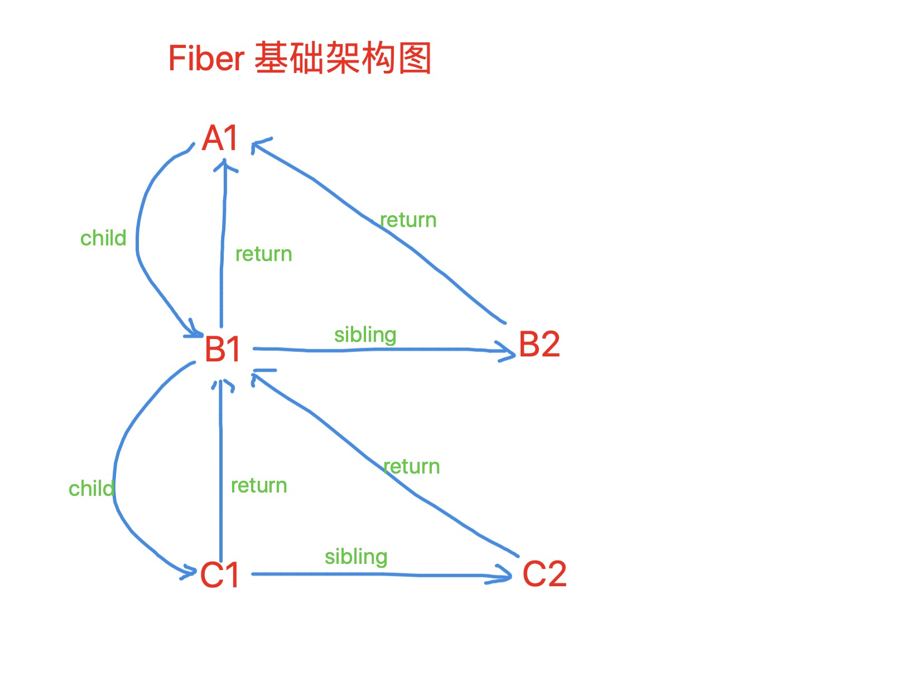

## 概念

1. ##### React应用，从始至终，管理三个基本树结构

   1. Root 整个应用的根，一个对象，有个属性指向 `current` 树，有另一个属性执行 `workInProgress` ；

   2. `current` 树，树上每一个节点都是 `fiber` ，保存的是上一次状态，并且每个fiber节点都对应着一个 JSX 节点；

   3. `workInProgress` 树上每一个节点都是 `fiber` ，保存的是本次新的状态，并且每个fiber节点都对应着一个 JSX 节点。

      备注：在初次渲染的时候，没有 current 树，react 在一开始创建 Root ，就会同时创建一个 uninitalFiber, （未初始化的 fiber），让 current 指向 uninitalFiber，之后再去创建一个 `workInProgress`。

2. ##### react 虚拟DOM渲染到页面的两个主要阶段

   1. render 阶段

      a、为每个节点创建新的fiber(workInProgress)，生成一颗有新状态的 workInProgress 树；

      b、初次渲染的时候(或新创建了某个子节点的时候)会将这个 fiber 创建的真实的DOM实例，并且对当前节点的子节点进行插入；

      c、如果不是初次渲染的话，就对比新旧的fiber的状态，将产生了更新的fiber节点，最终通过链表的形式挂载到 RootFiber 上。

   2. commit 阶段，真正操作页面的阶段

      a、执行生命周期

      b、会将 RootFiber 上获取到那条链表，根据链表上的标识来操作页面

   ###### 备注: 分为 reconcilation 协调 和 commit 阶段

   a、协调阶段，diff 阶段，这个阶段可以被中断，这个阶段找出所有节点变更，例如节点的新增，删除，修改属性，这些变更称为 effect 副作用。

   b、提交节点，将上一个阶段计算出来的副作用 effect 依次执行，同步执行，不能被打断。

3. ##### Fiber

   1. Fiber 之前的协调

      React 会对比 虚拟DOM 树，找出需要变动的节点，然后同步更新。这个过程称为 reconcilation 协调，

      在 reconcilation 期间，浏览器会一直占用资源，一则会导致用户触发的事件得不到响应，二则可能会出现掉帧。递归调用，不能中断，执行栈会越来越深。

   2. fiber 可以理解为新出的一种数据结构

   3. 虚拟DOM是对真实DOM的一种简化，一些真实DOM不能做的事情，虚拟DOM更不能做

   4. 基于以上1，2，出现了fiber架构，给fiber基本单元上添加很多属性，以此希望来实现更多的功能和算法

   5. 总的来说: fiber 基本数据结构 + fiber 算法 = fiber 架构

4. ##### setState 更新是异步还是同步的

   1. 如果是正常情况下，没有使用 `Concurrent` 组件的情况下，是同步更新，但是不会立刻获取到最新的 state 值，是因为 setState 是单纯的把参数传递放入到队列 updateQueue 中，只有等到事件结束，会触发回调函数，更新视图；
   2. 当使用了 `Concurrent`组件的时候，是异步更新模式，同样没有办法立刻获取最新数据，并且在整个更新和渲染过程中，使用了 postMessage， messageChanne 的异步方法；
   3. 当使用了 flushSync 这个api 的时候，时候是完全同步的，会立即触发更新；
   4. 当不使用react的合成事件时，转而使用 `addEventListener`,  也会直接会立即触发更新；
   5. 当使用  setTimeout 时，也会直接会立即触发更新。

5. ##### 什么时候使用状态管理器

   1. 从组件角度看：

      某个组件的状态，需要共享；

      某个状态需要在任何地方都可以拿到；

      一个组件需要改变全局状态；

      一个组件需要改变另一个组件的状态。

   2. 项目的整体看：

      用户的使用方式复杂；

      不同身份的用户有不同的使用方式（比如普通用户和管理员）；

      View要从多个来源获取数据。

   3. FLUX 设计思想 & REDUX 

      [参考文献1](https://juejin.im/entry/586c673bac502e006154d4c5)

      [参考文献2](https://juejin.im/post/5ec5ea9a51882542e6477c55#heading-0)

   4. Redux有三大原则

      单一数据源， state 只读，使用纯函数来执行

   5. Redux中的中间件

      ```javascript
      // 多层柯里化的 
      middleware =（store) => (next) => (action) => { [return next(action)]}
      ```

      提供的是位于 Action 被发起之后，到达 Reducer 之前的扩展点，如果不是我们想要的action，<u>我们可以在这里统一处理成想要的Action，再转交给Reducer处理</u>

6. ##### HOOKS优缺点

   1. 缺点

      a. Hooks的出现在一定程度上解决了组件间功能复用的问题，这种逻辑的封装和复用确实很香，但还存在某些问题，比如说数据的共享。

7. ##### render函数中return如果没有使用()会有什么问题

   ```javascript
   // 官方给的提示，如果返回
   return; 
   return undefined;
   // Nothing was returned from render. This usually means a return statement is missing. Or, to render nothing, return null.
   
   // react 在创建组件实例时，回处理成没有返回值，一个组件没有返回值是不被允许的
   ```

   

8. ##### componentWillUpdate可以直接修改state的值

   ###### a. 不能，造成死循环

   ```javascript
   // Maximum update depth exceeded. This can happen when a component repeatedly calls setState inside componentWillUpdate or componentDidUpdate. React limits the number of nested updates to prevent infinite loops
   ```

   ###### b. 官方声明周期解释

   1. componentWillMount 在渲染前调用,在客户端也在服务端。

   2. componentDidMount : 在第一次渲染后调用，只在客户端。之后组件已经生成了对应的DOM结构，可以通过this.getDOMNode()来进行访问。 如果你想和其他JavaScript框架一起使用，可以在这个方法中调用setTimeout, setInterval或者发送AJAX请求等操作(防止异步操作阻塞UI)。

   3. componentWillReceiveProps 在组件接收到一个新的 prop (更新后)时被调用。这个方法在初始化render时不会被调用。

   4. shouldComponentUpdate 返回一个布尔值。在组件接收到新的props或者state时被调用。在初始化时或者使用forceUpdate时不被调用。 
      可以在你确认不需要更新组件时使用。

   5. componentWillUpdate在组件接收到新的props或者state但还没有render时被调用。在初始化时不会被调用。

   6. componentDidUpdate 在组件完成更新后立即调用。在初始化时不会被调用。

   7. componentWillUnmount在组件从 DOM 中移除的时候立刻被调用。

   

9. ##### HOC & 渲染劫持 [参考链接](https://juejin.im/post/5e169204e51d454112714580#heading-14)

   1. 高阶组件概念

      高阶组件（HOC，Higher-Order Components）不是组件，而是一个**函数**，它会接收一个组件作为参数并返回一个经过改造的新组件

      ```javascript
      const EnhancedComponent = higherOrderComponent(WrappedComponent);
      ```

   2. 使用高阶的原因，即高阶组件解决的问题

      1. 抽取重复代码，实现组件复用，常见场景：页面复用，react-redux 的统一订阅，取消订阅
      2. 条件渲染，控制组件的渲染逻辑（渲染劫持），常见场景：权限控制。
      3. 捕获/劫持被处理组件的生命周期，常见场景：组件渲染性能追踪、日志打点。

   3. 高阶组件实现

      1. 属性代理

      2. 反向继承，

         反向继承指的是使用一个函数接受一个组件作为参数传入，并返回一个继承了该传入组件的类组件，且在返回组件的 `render()` 方法中返回 `super.render()` 方法

         ```javascript
         const HOC = (WrappedComponent) => {
           return class extends WrappedComponent {
             render() {
               return super.render();
             }
           }
         }
         ```

         1. 劫持原组件的生命周期
         2. 反向继承方式实现的高阶组件中可以读取、编辑和删除传入组件实例中的 `state`
         3. 渲染劫持，根据条件过滤数据
         4. 修改React元素，React.cloneElement

   4. 什么是渲染劫持

      **渲染主要指的是组件中的render函数return的JSX语法部分。劫持呢？如果我们在组件内部去修改JSX语法，这不叫劫持，这是分内的事情。劫持指的是在本不应该修改到JSX语法的地方修改了它。怎么实现呢？一般都是通过继承被劫持的组件。**
      **HOC（高阶组件）有一种反向继承的用法。当然，不止HOC，我们也可以新写一个组件，继承一个已有的组件，在这里就可以随意修改render函数，使用state、props这些状态数据，改变了原组件的渲染，这就叫渲染劫持。**

10. ##### Context

   Context 有哪些属性

   怎么使用 Context

   为什么不优先使用 Context

   ContextType

   

11. ##### ReactDOM.createPortal

    1. 通过`ReactDOM.createPortal(child, container)`创建，是ReactDOM提供的接口，可以实现将子节点渲染到父组件DOM层次结构之外的DOM节点。
    2. 对于 portal 的一个典型用例是当父组件有 overflow: hidden 或 z-index 样式，但你需要子组件能够在视觉上 “跳出(break out)” 其容器。例如，对话框、hovercards以及提示框。所以一般react组件里的模态框，就是这样实现的。

12. ##### 错误边界处理

    如果一个 class 组件中定义了 [`static getDerivedStateFromError()`](https://zh-hans.reactjs.org/docs/react-component.html#static-getderivedstatefromerror) 或 [`componentDidCatch()`](https://zh-hans.reactjs.org/docs/react-component.html#componentdidcatch) 这两个生命周期方法中的任意一个（或两个）时，那么它就变成一个错误边界。当抛出错误后，请使用 `static getDerivedStateFromError()` 渲染备用 UI ，使用 `componentDidCatch()` 打印错误信息。

    备注，错误边界**无法**捕获以下场景中产生的错误：

     1. 事件处理

     2. 异步代码（例如 `setTimeout` 或 `requestAnimationFrame` 回调函数）

     3. 它自身抛出来的错误（并非它的子组件）

        ```javascript
        class ErrorBoundary extends React.Component {
          constructor(props) {
            super(props);
            this.state = { hasError: false };
          }
        
          static getDerivedStateFromError(error) {
            // 更新 state 使下一次渲染能够显示降级后的 UI
            return { hasError: true };
          }
        
          componentDidCatch(error, errorInfo) {
            // 你同样可以将错误日志上报给服务器
            logErrorToMyService(error, errorInfo);
          }
        
          render() {
            if (this.state.hasError) {
              // 你可以自定义降级后的 UI 并渲染
              return <h1>Something went wrong.</h1>;
            }
        
            return this.props.children; 
          }
        }
        ```

        

13. ##### react 声明组件的几种方式 [参考文章](https://juejin.im/post/5e041c99518825123e7b0602)

    1. 无状态组件，props 传递， + hooks
    2. 有状态组件
    3. HOC
    4. Render-props  => this.props.children 书写方式

14. ##### 浅谈React性能优化的方向 [参考文献](https://juejin.im/post/5d045350f265da1b695d5bf2#heading-0)

   

11. react 数据

    ```
    npm i redux-persist
    ```

12. Fiber 16之前

    1. React会递归对比 VDOM，找出需要变动的节点，然后同步更新它们，这个过程成为 `Reconcilation` (协调);
    2. 在 `Reconcilation` 期间，**<u>React 会一直占用浏览器资源</u>**，可能导致用户触发的事件得不到及时响应，也可能会出现掉帧，卡顿。

    3. 递归调用，执行栈越来越深，而且不能中断。

13. Fiber 是什么

    1. fiber 是一个执行单元；

    2. 可以通过调度策略合理分配CPU资源，从而提高用户的响应速度；

    3. 通过Fiber 架构，让自己的 `Reconcilation` 过程可以被中断，适时地让出CPU执行权。

14. fiber 基础架构JSON示意图 & 流程图

    ```javascript
    let root = {
        key: "A1",
        children: [
            {
                key: "B1",
                children: [
                    {
                        key: "C1",
                        children: []
                    },
                    {
                        key: "C2",
                        children: []
                    }
                ] 
            },
            {
                key: "B2"
            }
        ]
    }
    ```

    

